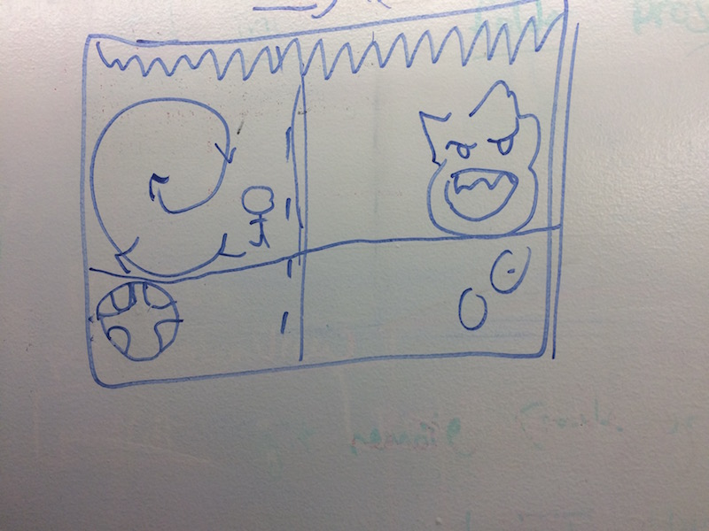
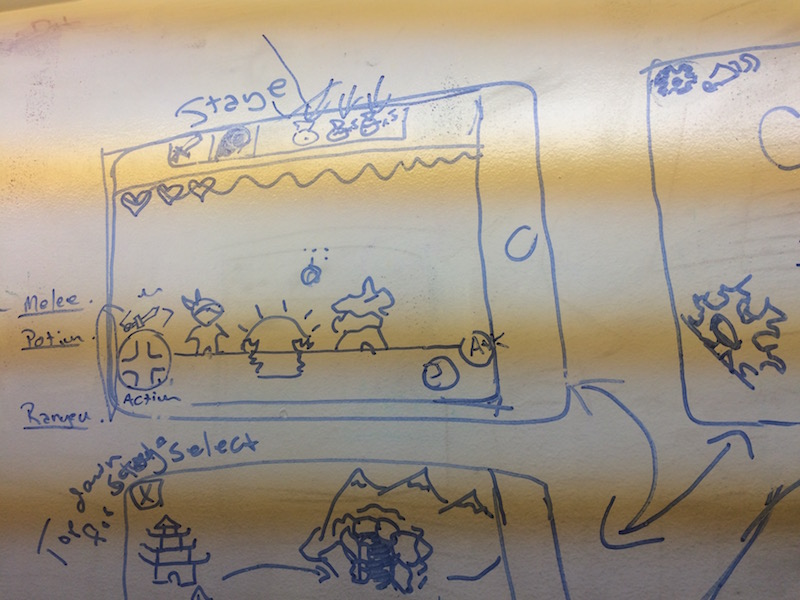
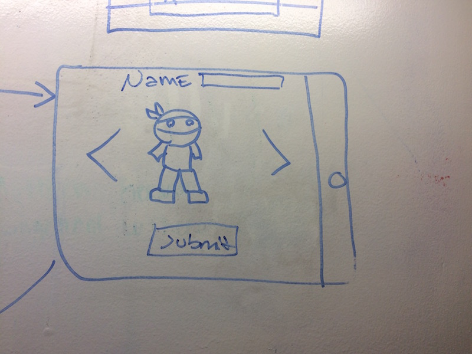
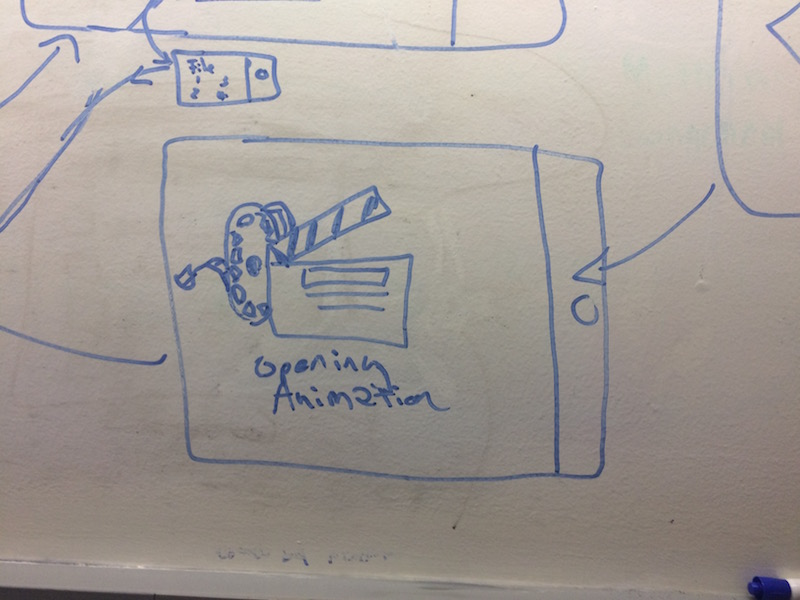
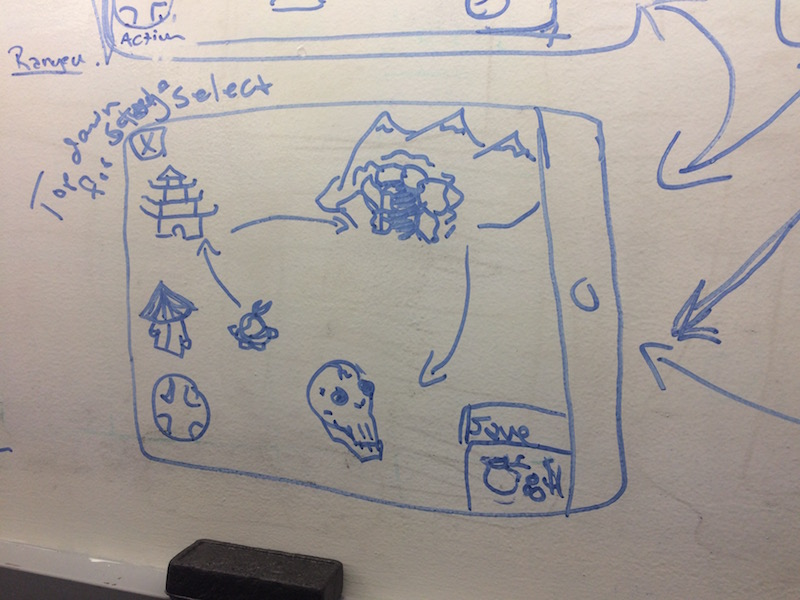

#Castle-Dash

##Elevator pitch
A two dimensional adventure game that focuses on player momentum to traverse increasingly difficult levels and defeating enemies.

##Technology Used

 * JavaScript
 * Java
 * H2
 * Spring/Hibernate
 * phaser.io
 * Cocoon (roadmap)
 * PhoneGap
 * Gulp

##MVP Features
 * Players traverse 2D environments
 * Player encounters enemies and hazards (spikes, lava, etc..)
 * Players can pick up potions to use on self or for ranged attacks
 * Players can obtain currency off defeated enemies
 * Players can access a store to restock their inventory
 * Players have three separate save files
 * Enemies change every time you play the game.
 * Create character, can customize stats and visuals.
 * Autosaves at the end of each level

##User Stories

##2D Traversal
####Value Statement:
As a player I can move forward and back through the scene so that I can adventure/explore/progress through the game.

####Acceptance Criteria
1. As player moves right and left, if the player stays left of the progression line, the camera remains fixed.
2. If the player crosses to the right of the progression line, the camera pans right to keep the player left of the progression line.
3. At no point will the camera pan left.
4. Player cannot traverse left of the left edge of the camera. (There is no going back).

####Wireframes

##Hazards
####Value Statement:
As a player I can encounter hazards so that the game is more challenging.

####Acceptance Criteria
1. Hazards exist, including spikes, holes, lava, fire, and acid.
2. If a user touches a hazard, they lose health.
3. Hazard position is fixed relative to the environment. (That is why we call them environmental hazards).

####Wireframes

##Inventory
####Value Statement
As a player, I can collect/buy items, store them in my inventory, and select items to use during the game in order to defeat enemies and bypass hazards.

####Acceptance Criteria
1. Inventory items may include weapons, potions, armors, currency and gadgets.
2. Inventory items affect player stats in game, health, defense, attack damage etc.
3. Inventory items are obtainable from the in game merchant, may also be available via defeated enemies.
4. Inventory is accessible from within the level.
5. Current equipped inventory items displayed.
####Wireframes

##Weapon Wheel
####Value Statement
Weapon wheel is tied to the up control pad inside each level in order to easily and quickly cycle through available weapons/potions/ranged in inventory.
####Acceptance Criteria
1. Use the up arrow in dungeon to cycle between ranged, melee, potions
2. Display currently selected melee, ranged, or potion above the up arrow.
3. Currently selected item has horizontal scroll to select item within that category.
####Wireframes

##Store
####Value Statement
As a player, I can obtain currency from defeated enemies to spend in a store to restock my inventory.
####Acceptance Criteria
1. Currency (coins) can be obtained from defeating enemies.
2. Coins vary depending on the difficulty of the enemy defeated.
3. When the enemy is defeated, coins fall to the ground.
4. Coins are picked up by walking over them.
5. Coins can be spent in the store in order to restock inventory.

####Wireframes

##Enemies
####Value Statement
As a player I encounter enemies so that I can be challenged.

####Acceptance Criteria
1. Enemies exist including bats, knights, kninjas, dragons, ninja dragons, goblins, ogres. etc.
2. Enemies can have projectile attacks
3. If a user touches an enemy or enemy projectile, player loses health.
4. Enemies can be fixed or move
5. Players can attack and kill enemies.
6. Enemies are affected by hazards.
7. Enemies are stupid.
8. Enemies are worth currency value upon defeating them

####Wireframes

##Enemy Generation
####Value Statement
As a player I will encounter randomized enemies in order to have a varied and overall more rich gameplay experience.
####Acceptance Criteria
1. Enemies exist
2. Enemies are chosen randomly from an array of potential enemies
3. Potential enemies are chosen based on player’s stats

####Wireframes

##Player melee attack
####Value Statement
As a Player I can use a variety attacks and abilities to fight enemies in order to gain currency and progress through level.

####Acceptance Criteria
1. Player has melee attack
2. Player melee attack is based on multiplier of melee weapon damage and player strength
3. Player has forward strike (strikes in direction they are facing)
4. Player has spiral strike when in air (spins slashing around them)
5. Melee weapon may be selected from in game weapon wheel.

####Wireframes

##Player ranged attack
####Value Statement
As a player, I can use a ranged weapon to fight enemies in order to gain currency and progress through level.
####Acceptance Criteria
1. Player has ranged attack
2. Ranged attack is dependant on current ranged weapon
3. Ranged attack damage is dependant on weapon strength and player strength
4. Ranged attacks travel horizontally until they are off screen
5. Ranged attacks disappear after they go off screen
6. Ranges Weapon may be selected from in game weapon wheel.
####Wireframes

##Player Potions
####Value Statement
As a player I have a collection of potions I can drink or toss to gain stats or damage enemies.
####Acceptance Criteria
1. There may be 3 different kinds of potions including shield, health, fire, etc.
2. Potions may be consumed by the Player for increased health, stats, or temporary buffs to damage
3. Potions may be thrown to cause damaging effects on enemies.
4. Potions may be selected from in game weapon wheel.
####Wireframes

##Save Game
####Value Statement
As a player I can save my game so that I may return to it at a later time and continue my progress.

####Acceptance Criteria
1. The game will hold up to 3 saved game files per player.
2. Saved game files can be selected from the load game screen.
3. Saved files will store current player stats, inventory, and progress.
4. Game will save automatically upon level completion to the save file that was loaded, or to a new save file if the game is new.
5. Saved games may be deleted
6. Loading a saved game will spawn player into the over world.
7. If three save files exist, player must delete a save file before creating a new game.

####Wireframes

##Character Customization
####Value Statement
As a player creating a new game I can customize the looks and stats of my player character to create my own difficulty and experience.

####Acceptance Criteria
1. Character Customization should allow for choosing one of several preloaded characters.
2. Character Customization should allow for custom point distribution into Character’s stats.
3. Character Customization should be followed by intro to game.
4. Character Customization should allow for creating your saved files unique name.
####Wireframes

##Animation Intro
####Value Statement
After Character Customization as a player I should be shown an intro animation to set the stage and story of the game.
####Acceptance Criteria
1. Animation should introduce Player to their character
2. Animation should introduce Player to the story of the game
3. Animation should be short and explain win condition/goal for the game.
4. Animation should load the Player’s character into the overworld at start of the game.

####Wireframes

##Overworld
####Value Statement
As a player, I will be able to select the level I want to play through a simple overworld map in order to replay levels and see my overall progress.
####Acceptance Criteria
1. Overworld screen will be viewed before and after levels
2. Overworld will have a top down view of the world map.
3. Players can navigate along a set path to replay old levels.
4. Levels the player has not played cannot be selected unless the previous level has been completed
5. The store will be accessible from the overworld.
####Wireframes

##You are dead outro
####Value Statement
As a player, I will be notified when I have died by a screen in order to accept my defeat
####Acceptance Criteria
1. Death screen will display after player’s hearts are depleted or player has fallen down pit
2. Overworld will load after death screen.
3. Options to exit game or reload overworld will be present on death screen
####Wireframes
